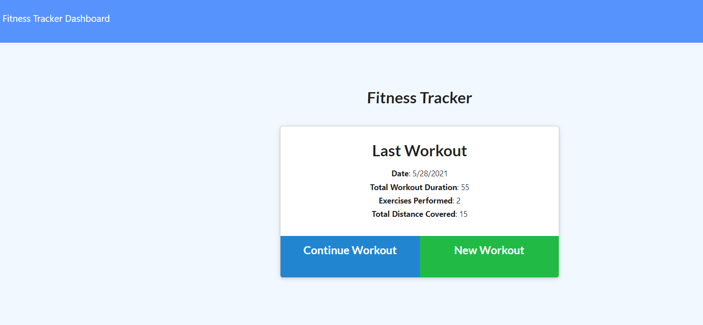

# Fitness_Tracker

* [Acceptance Criteria](#acceptancecriteria)
* [Installation](#installation)
* [Project Status](#projectstatus)
* [License](#license)
* [Deployment](#deployment)
* [Usage](#usage)
* [Preview of the App](#previewApp)

# User Story

As a user, I want to be able to view create and track daily workouts. I want to be able to log multiple exercises in a workout on a given day. I should also be able to track the name, type, weight, sets, reps, and duration of exercise. If the exercise is a cardio exercise, I should be able to track my distance traveled. For this project, I aim to build a Mongo database with a Mongoose schema and handle routes with Express.

# Business Context

A consumer will reach their fitness goals more quickly when they track their workout progress.

# Acceptance Criteria
When the user loads the page, they should be given the option to create a new workout or continue with their last workout.

The user should be able to:
  * Add exercises to the most recent workout plan.
  * Add new exercises to a new workout plan.
  * View the combined weight of multiple exercises from the past seven workouts on the `stats` page.
  * View the total duration of each workout from the past seven workouts on the `stats` page.

# Installation
In order to use this app, you will need to use the Mongo database with a Mongoose schema and handle routes with Express.

# Project Status
This project was completed on May 29, 2021. 

# License
MIT

# Deployment
[Link](https://fitnesstracker-obi.herokuapp.com/)

Add screenShot
# Preview of the App
* This is how the app looks
